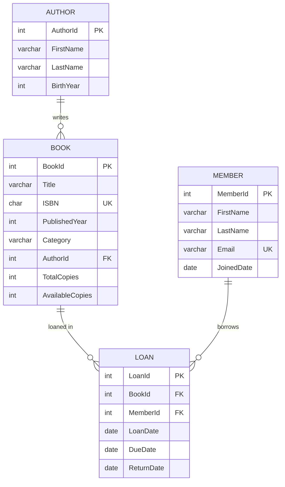

# LibraryDB — ERD (Mermaid)

Schema for our Library ERD so far.

Notes:
- `UK` = "unique keys" (ISBN, Email). `FK` lines = `Book.AuthorId`, `Loan.BookId`, `Loan.MemberId`.
- `Category` on `BOOK` + single author per book = deliberate simplifications (Wed normalization demo fixes both).
