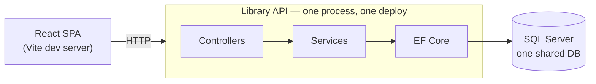
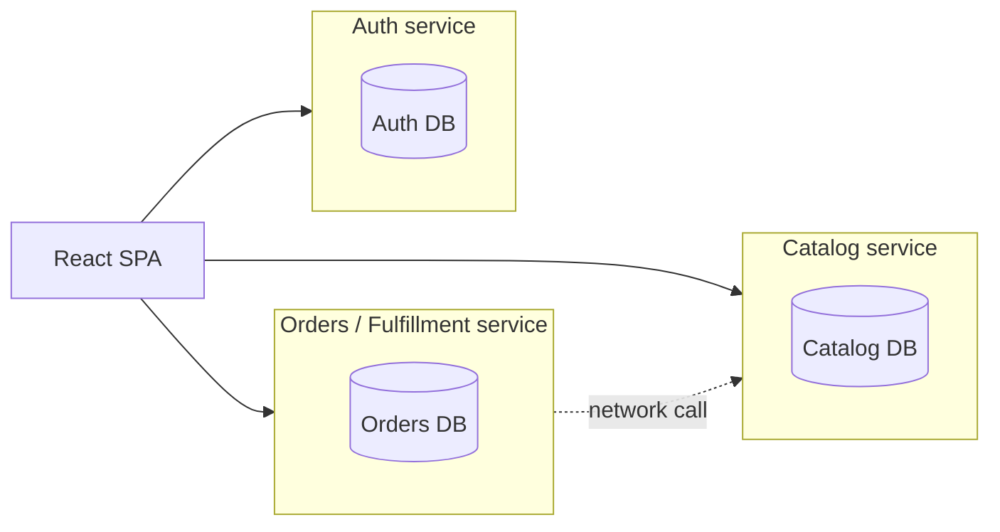
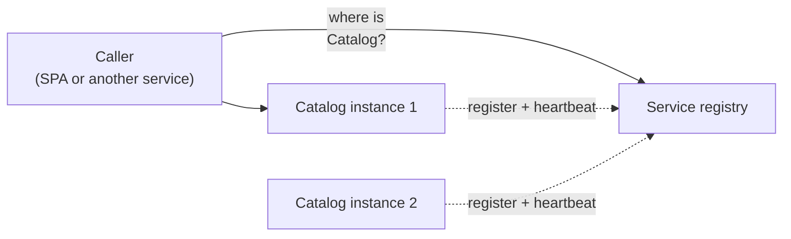
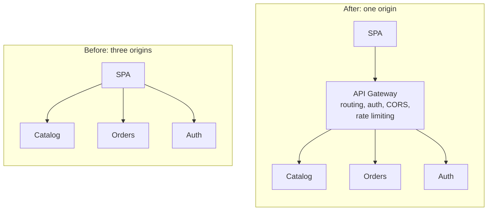
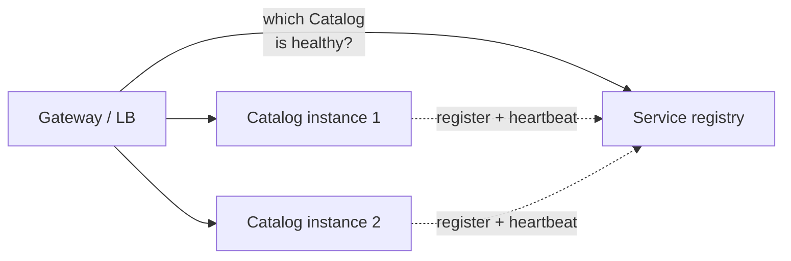
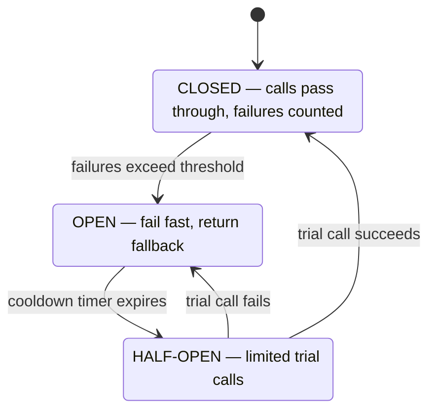

# Carving the Library Monolith: The Whiteboard, Preserved

The Thursday microservices lecture carved the app this cohort built — the Library API + React SPA —
into services on the whiteboard, one problem at a time. These are those diagrams, kept so the board
survives the eraser. The prose depth behind each one lives in
[msa-fundamentals.md](msa-fundamentals.md) and
[msa-infrastructure-patterns.md](msa-infrastructure-patterns.md); this file is the picture book.

## 1. The as-built: a monolith (and that is not an insult)

One codebase, one process, one database, one deploy. This is the app you built — and your P2.

The monolith is the default architecture and the right starting point. See
[Why a monolith is often the right first choice](msa-fundamentals.md#why-a-monolith-is-often-the-right-first-choice).

## 2. The carve: three services, three databases

Cut along business capabilities — Catalog, Orders/Fulfillment, Auth — each independently deployable,
each **owning its data**. Every in-process method call that crossed a cut is now a network call: it
can be slow, fail, or arrive twice. The shared database is gone on purpose — keep it and you have a
**distributed monolith** (all of the cost, none of the benefit).

## 3. Registry and discovery: who is where right now?

Instances are ephemeral — new ports and addresses on every deploy (you have debugged the hard-coded
version). A **service registry** is the live directory: instances register on startup, heartbeat, and
drop out when unhealthy. **Discovery** is looking a logical name up in it to get a concrete address —
done by the caller itself (client-side) or by a router the caller hits (server-side).

## 4. The gateway: one origin again

Without it, the SPA faces three origins — three CORS configs, three places validating your Bearer
token (you have felt this pain). An **API gateway** is the single entry point: routing plus the
cross-cutting concerns (auth, CORS, rate limiting, logging) written once at the edge. Kept thin —
never business logic — and run redundantly, because it sits on every request's path.

## 5. Load balancing: spreading the load across copies

When a hot service runs as several identical instances, the balancer (here drawn in the gateway)
spreads requests across the healthy ones — round-robin when requests are uniform, least-connections
when some are heavy — using the registry's health info to skip dead instances.

## 6. The circuit breaker: failing fast beats failing slow

A dependency that is *slow* is more dangerous than one that is down: every caller blocks on it,
threads pile up, and the failure **cascades**. The breaker wraps the remote call and trips open when
failures spike — callers get an immediate fallback instead of a 30-second wait, and the sick service
gets room to recover.

Used with timeouts, retries with backoff, and bulkheads; Polly implements the family in .NET. See
[Circuit breaker](msa-infrastructure-patterns.md#circuit-breaker).

## The verdict from beat 8: is our app SOA?

No. The as-built app is a **monolith with a service layer** — one deployable, so neither SOA nor MSA.
The carved version above is **microservices**, not classic SOA: fine-grained services, **smart
endpoints and dumb pipes**, a private database each — where SOA centralized routing and
transformation in a smart Enterprise Service Bus (historically over SOAP) with a shared canonical
model. Full comparison table:
[Microservices vs SOA](msa-fundamentals.md#microservices-vs-service-oriented-architecture-soa).
