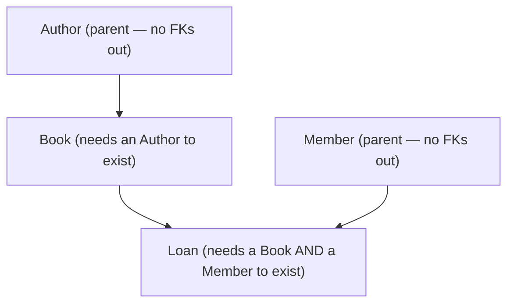

# DML: Changing Data (INSERT / UPDATE / DELETE)

## Learning Objectives

- Add rows with `INSERT` (single-row, multi-row, and insert-from-`SELECT`).
- Modify rows with `UPDATE`, always scoped by a `WHERE` clause.
- Remove rows with `DELETE`, scoped by `WHERE`.
- State precisely the difference between **DROP**, **DELETE**, and **TRUNCATE**.
- Respect foreign keys when writing data (parents before children).

> **Where to run this:** execute these statements against a SQL Server database using **SSMS** or **Azure Data Studio**. New to the setup? The Day-1 `00-setup-docker` walkthrough stands up SQL Server in a container — then run everything against your `sql-training` database.

## Why This Matters

Yesterday you built an empty schema; today you bring it to life. **DML** (Data **Manipulation** Language) is how data gets *into* and *changes within* your tables — the "populate" beat of the week's epic. Without it, a database is a blueprint with no building. This is the front half of the `02-dml-dql` commit: seed the `LibraryDB` schema with real authors, members, books, and loans so that tomorrow's reads, Thursday's joins, and Friday's transactions have something to work on.

DML is also where one small mistake does real damage. An `UPDATE` or `DELETE` without a `WHERE` clause hits *every row*. QC-2 asks you to "construct DML statements to manipulate pre-existing data" and to "describe the difference between DROP, DELETE, and TRUNCATE" — and that second one is one of the most common SQL interview questions there is. This note nails both.

## The Concept

### INSERT: add rows

```sql
-- single row, naming the columns (always name them)
INSERT INTO dbo.Author (FirstName, LastName, BirthYear)
VALUES ('Ada', 'Lovelace', 1815);

-- multiple rows in one statement
INSERT INTO dbo.Author (FirstName, LastName, BirthYear)
VALUES ('Alan', 'Turing', 1912),
       ('Grace', 'Hopper', 1906),
       ('Edsger', 'Dijkstra', 1930);
```

- **Always name the columns** (`INSERT INTO Author (FirstName, LastName, ...)`). Relying on positional order (`INSERT INTO Author VALUES (...)`) breaks the moment someone adds or reorders a column — and it forces you to supply *every* column.
- **Don't supply `IDENTITY` columns.** `AuthorId` is auto-generated; omit it and the engine assigns 1, 2, 3…
- **Omitted columns** take their `DEFAULT` (e.g. `JoinedDate`) or `NULL` if allowed; a `NOT NULL` column with no default *must* be given a value.

Insert the result of a query (copy/derive rows):

```sql
INSERT INTO dbo.ArchivedMember (FirstName, LastName, Email)
SELECT FirstName, LastName, Email
FROM dbo.Member
WHERE JoinedDate < '2020-01-01';
```

### Order matters: parents before children

Foreign keys mean you must insert in **dependency order**. A `Book` references an `Author`, and a `Loan` references both a `Book` and a `Member`, so:



Insert a `Book` with `AuthorId = 5` before author 5 exists and the FK rejects it. Seed parents first.

### UPDATE: change existing rows

```sql
-- give book 1 two more copies
UPDATE dbo.Book
SET    TotalCopies = TotalCopies + 2,
       AvailableCopies = AvailableCopies + 2
WHERE  BookId = 1;
```

- **`SET col = value`** changes columns; you can set several at once, comma-separated.
- **The `WHERE` clause decides which rows.** This is the part to never forget.
- You can compute from the current value (`TotalCopies + 2`) — the right-hand side sees the old row.

> **The `WHERE`-less catastrophe.** `UPDATE dbo.Book SET AvailableCopies = 0;` sets **every book** to zero. There is no undo outside a transaction (Friday). Before running an `UPDATE`/`DELETE`, run the matching `SELECT ... WHERE` first to see exactly which rows you'll hit.

### DELETE: remove rows

```sql
-- remove one specific cancelled loan
DELETE FROM dbo.Loan
WHERE  LoanId = 42;

-- remove a set of rows by condition
DELETE FROM dbo.Loan
WHERE  ReturnDate IS NOT NULL AND LoanDate < '2019-01-01';
```

- `DELETE` removes **whole rows** the `WHERE` picks. To clear part of a row, that's an `UPDATE` setting columns to `NULL`, not a `DELETE`.
- Foreign keys constrain deletes too: you can't delete a parent that still has children unless the FK says `ON DELETE CASCADE` (then the children go too) — otherwise the engine blocks it.
- `DELETE` with **no `WHERE`** removes every row (but, unlike `TRUNCATE`, logs each one and does not reset `IDENTITY`).

### DROP vs DELETE vs TRUNCATE — the exam answer

The single most-asked SQL distinction. Memorize this grid:

| | What it removes | Sublanguage | `WHERE`? | Resets IDENTITY? | Logged | Rollback-able | Speed |
|---|---|---|---|---|---|---|---|
| **DROP** | the **table itself** (structure + data) | DDL | n/a | n/a (gone) | minimal | yes (in a txn) | fast |
| **TRUNCATE** | **all rows**, keeps the table | DDL | **no** | **yes** (back to seed) | minimal (per page) | yes (in a txn, SQL Server) | very fast |
| **DELETE** | **chosen rows** (or all) | DML | **yes** | **no** | per row | yes | slower |

The one-line mental model:

- **DROP** = "this table should not exist." → *entity gone.*
- **TRUNCATE** = "empty this table, fast, reset its ids." → *all rows, no filter.*
- **DELETE** = "remove these particular rows." → *surgical, by condition.*

Two gotchas interviewers reward:
- **TRUNCATE resets `IDENTITY` to its seed; DELETE does not.** Truncate then insert → ids restart at 1. Delete all then insert → ids continue where they left off.
- **TRUNCATE can be blocked** when the table is referenced by a foreign key, or participates in certain features; `DELETE` works row-by-row and respects/triggers per-row FK actions and triggers.

## Code Example

A full seed pass in dependency order, then a couple of edits — exactly the shape of the `02-dml-dql` commit's DML half:

```sql
-- 1) parents first
INSERT INTO dbo.Author (FirstName, LastName, BirthYear)
VALUES ('Robert', 'Martin', 1952), ('Martin', 'Fowler', 1963);

INSERT INTO dbo.Member (FirstName, LastName, Email)
VALUES ('Ada', 'Byron', 'ada@lib.org'), ('Alan', 'M', 'alan@lib.org');

-- 2) children that reference them
INSERT INTO dbo.Book (Title, ISBN, AuthorId, PublishedYear, TotalCopies, AvailableCopies)
VALUES ('Clean Code',       '9780132350884', 1, 2008, 3, 3),
       ('Refactoring',      '9780201485677', 2, 2018, 2, 2);

INSERT INTO dbo.Loan (BookId, MemberId, DueDate)
VALUES (1, 1, '2026-07-10');   -- LoanDate defaults to today; ReturnDate stays NULL (still out)

-- 3) a checkout reduces available copies
UPDATE dbo.Book SET AvailableCopies = AvailableCopies - 1 WHERE BookId = 1;

-- 4) the member returns it: stamp the return, restore the copy
UPDATE dbo.Loan SET ReturnDate = GETDATE() WHERE LoanId = 1;
UPDATE dbo.Book SET AvailableCopies = AvailableCopies + 1 WHERE BookId = 1;
```

After the loan + first update, `Book 1` reads:

| BookId | Title | TotalCopies | AvailableCopies |
|---|---|---|---|
| 1 | Clean Code | 3 | 2 |

## Common Mistakes / Interview Traps

- **`UPDATE`/`DELETE` with no `WHERE`.** Hits every row. Always preview with a `SELECT ... WHERE` first.
- **Positional `INSERT` (`VALUES` with no column list).** Brittle and forces every column. Name your columns.
- **Inserting an `IDENTITY` value.** You normally can't (and shouldn't); let the engine assign it.
- **Ignoring FK order.** Insert children before parents → FK violation. Parents first; delete in reverse.
- **Reaching for `TRUNCATE` to "delete some rows."** `TRUNCATE` is all-or-nothing with no `WHERE`. Use `DELETE` for a subset.
- **Assuming `DELETE` resets ids.** It doesn't — only `TRUNCATE` does.

## Decision Guide: which removal tool?

| Goal | Use |
|---|---|
| Drop a subset by condition | `DELETE ... WHERE` |
| Wipe the table, fast, restart ids, reload | `TRUNCATE TABLE` |
| Get rid of the table object entirely | `DROP TABLE` |
| Clear a *column* but keep the row | `UPDATE ... SET col = NULL` (not a delete at all) |

## Summary

- **DML = `INSERT` / `UPDATE` / `DELETE`** — it changes the *data*, not the structure.
- **`INSERT`** with an explicit column list; omit `IDENTITY`; seed **parents before children**.
- **`UPDATE`** and **`DELETE`** are scoped by `WHERE` — forget it and you hit every row.
- **DROP** removes the table, **TRUNCATE** fast-empties all rows and **resets IDENTITY**, **DELETE** removes **chosen rows** and does **not** reset ids.
- Preview destructive writes with a `SELECT` first; that habit prevents the worst SQL accidents.

## Additional Resources

- [INSERT (Transact-SQL) — Microsoft Learn](https://learn.microsoft.com/en-us/sql/t-sql/statements/insert-transact-sql)
- [UPDATE (Transact-SQL) — Microsoft Learn](https://learn.microsoft.com/en-us/sql/t-sql/queries/update-transact-sql)
- [DELETE vs TRUNCATE TABLE — Microsoft Learn](https://learn.microsoft.com/en-us/sql/t-sql/statements/truncate-table-transact-sql)
