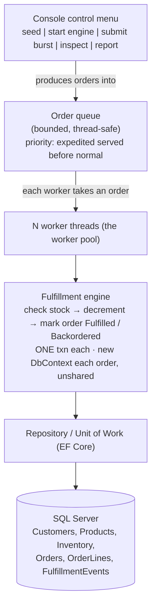

# Project — Order Fulfillment Engine (Solo Capstone, 2-Week Sprint)

## Objective

Build **one coherent, production-shaped backend app**: an **Order Fulfillment Engine** that takes a stream of
incoming orders and fulfills them **concurrently** against a **shared, limited inventory** stored in a real SQL
database through **EF Core**. This is not a worksheet of disconnected exercises — it is a single app you would
be comfortable demoing to a stakeholder as "the engine that processes our orders."

The headline engineering problem is **correctness under concurrency**: many workers draw down the same stock at
the same time, and your app must **never oversell** (never fulfill an order that takes inventory below zero)
while still going **measurably faster** than doing the work one order at a time.

You build this **solo**, over a **two-week sprint**, and **present it live on Friday of Week 5**.

Everything you need has been taught by the end of Week 4: C# and OOP (Wk1–2), collections, generics,
exceptions, design patterns, Serilog (Wk2), SQL — schema, joins, transactions, ACID, isolation, indexes (Wk3),
and EF Core, LINQ, data structures, and multithreading (Wk4). **No web framework is involved** — this is a
console application. REST/ASP.NET come in Week 5 / Project 2 and are explicitly **out of scope** here.

---

## Logistics

| | |
|---|---|
| **Handed out** | Mon Jun 29 (after the EF Core intro) |
| **Presented** | **Fri Jul 10** — live demo to the room/stakeholders |
| **Mode** | **Solo** — one learner, one repo, one domain |
| **Stack** | .NET console app · EF Core (code-first) · SQL Server in Docker · Serilog |
| **Submission** | Your `FirstName-LastName` repo: runnable app + migrations + seed + README writeup |
| **Scaffold** | **None.** No starter, no solution key. Designing the schema, the concurrency strategy, and the patterns **is** the project. |

---

## What You're Building

A **hybrid console app**: a small **control menu** that a human drives, sitting on top of a **background
worker pool** that does the real work concurrently.

The **menu** lets you (or a stakeholder watching) seed the catalog, kick off the engine, fire a **burst** of
orders at it, inspect live inventory/order state, and run **reports** — all while the worker pool keeps
draining the queue in the background and the menu stays responsive.

---

## Your Domain (pick your own — not Library)

The trainer demos use a **Library** domain. You build the **same ideas in a domain of your own** so the
submission is yours, not a copy. Any domain works as long as it is fundamentally **"a catalog of items with
limited stock, and a stream of orders competing for that stock."**

| Domain | "Product" | "Order" | The scarce thing |
|--------|-----------|---------|------------------|
| E-commerce | SKU / product | Customer order | Units on hand |
| Event ticketing | Show / section | Ticket purchase | Seats remaining |
| Restaurant kitchen | Menu item | Table ticket | Prepped portions |
| Warehouse picking | Bin item | Pick list | Bin quantity |
| Ride / appointment dispatch | Slot / vehicle | Booking | Available slots |

Pick one and commit to it. The rest of this spec is written domain-neutral — translate "Product / Order /
inventory" into your domain's nouns.

---

## What the App Must Do (User Stories)

Each story is a behavior a person at the menu (or a stakeholder watching the demo) can **see**. Each lists
**acceptance criteria** you can point at during the presentation.

### Catalog & inventory

- **Seed and inspect.** *As an operator, I can seed a catalog of products with starting stock and list current
  on-hand quantities at any time.*
  - Accept: after seeding, the inventory listing shows each product and its starting quantity; re-running the
    listing after fulfillment reflects the drawn-down numbers.

### Concurrent fulfillment (the core)

- **Fulfill a burst concurrently.** *As an operator, I can submit a burst of N orders and watch the worker pool
  fulfill them concurrently while the menu stays responsive.*
  - Accept: with the engine running, submitting a burst returns control to the menu immediately; order statuses
    move from Pending to a terminal state over time, processed by **multiple workers** (visible in the log).
- **Never oversell.** *As a stakeholder, I am guaranteed the engine never fulfills an order that would take
  stock below zero, even when many orders hit the same product at once.*
  - Accept: after a burst whose demand **exceeds** stock, **on-hand never goes negative** and **units fulfilled
    == units depleted** for every product. Orders that could not be met are cleanly **Backordered** (or
    Rejected), never partially oversold. **An order is all-or-nothing in one transaction:** if a multi-line order
    has any line that can't be met, the whole order is Backordered — no line is partially filled. (Restricting
    orders to a single line is a fine MVP simplification; say which you chose.)
- **Expedited first.** *As an operator, I can mark orders expedited, and the pool serves expedited orders ahead
  of normal ones.*
  - Accept: when expedited and normal orders are queued together, the expedited ones reach a terminal state
    first (visible by completion order / timestamps).

### Resilience & observability

- **Graceful shutdown.** *As an operator, I can stop the engine and it finishes or safely abandons in-flight
  work, drains cleanly, and flushes its logs — no lost or half-applied orders.*
  - Accept: after "stop", no order is left in a partial state (inventory decremented but order not marked, or
    vice versa); the log file is complete.
- **A trail of what happened.** *As an operator, I can read a structured log of engine activity tagged by
  severity (routine fulfillment / backorder warning / failure).*
  - Accept: a session shows info, warning, and error lines tied to real fulfillment events, with structured
    fields (order id, product, quantity), never string concatenation.

### Reporting & analysis

- **Reports.** *As a stakeholder, I can see top products and top customers by volume, and the overall
  fulfillment vs backorder rate.*
  - Accept: reports return different results for different seed/burst runs; a ranked report is sorted, and I can
    look a single product's rank up quickly.
- **Sequential vs parallel benchmark.** *As an engineer, I can run the same burst once sequentially and once
  with the full worker pool and see the time/throughput difference.*
  - Accept: the benchmark prints both timings and a speedup factor, and the parallel run is faster on a
    multi-core machine (or you explain why it is not). **Reset inventory to the same starting stock between the
    two runs** (re-seed, or snapshot and restore) — otherwise the sequential run depletes stock and the parallel
    run races an empty catalog, making the comparison meaningless.

---

## Engineering Definition of Done (how you build it)

The stories say *what*; these say *how*. This is the graded core.

### Data layer (EF Core, code-first, SQL Server)

- A **code-first** EF Core model of roughly these entities — normalized to **3NF**, with foreign keys and
  referential integrity:
  - `Customer` (id, name, unique email)
  - `Product` (id, **unique indexed SKU**, name, `decimal(10,2)` price)
  - `InventoryItem` (id, 1:1 to Product, `QuantityOnHand`, **`byte[] RowVersion` concurrency token**)
  - `Order` (id, FK to Customer, `Priority` enum, `Status` enum, created/completed timestamps)
  - `OrderLine` (id, FK to Order, FK to Product, quantity) — resolves the Order↔Product many-to-many
  - `FulfillmentEvent` (id, FK to Order, type, message, timestamp) — audit trail
- **Migrations** create the schema (`dotnet ef migrations add` / `database update`); a **seed** populates a
  catalog with known starting stock **and a set of customers** (orders carry a customer FK, so you need customers
  to submit against). Use **Data Annotations** for the simple constraints and the **Fluent API**
  in `OnModelCreating` for anything annotations cannot express (the concurrency token, the 1:1, indexes).
- At least one **index** beyond the keys (SKU and `Order.Status` are the obvious ones) — and you can say why.
- The **DbContext is your Unit of Work**, reached through a **repository behind an interface**. Callers depend
  on the interface, not on EF types directly.

### Concurrency (the headline)

- The fulfillment work runs on a **pool of N worker threads/Tasks** consuming from a **bounded, thread-safe
  queue** (`BlockingCollection<T>`), fed by a producer (the burst submitter) — the classic **producer-consumer**
  pattern. `BlockingCollection<T>` is one of the Week-4 thread-safe collections (named in the threading notes
  alongside the `ConcurrentDictionary`/`ConcurrentQueue` you demoed); here you wire it between a producer and a
  worker pool.
- **Each fulfillment uses its OWN `DbContext`.** `DbContext` is **not thread-safe** — sharing one across workers
  is the single most common way this project breaks. Create a context (and its unit of work) **per order
  fulfilled** and dispose it when that order is done — **not** one long-lived context per worker. (One context per
  order is the rule; "per worker" is the trap that drifts into a shared, stale tracker.)
- **No overselling.** Each fulfillment decrements stock inside **one transaction** (atomicity), and the
  inventory row is protected by **EF optimistic concurrency** (the `RowVersion` token): if two workers race the
  same product, the loser catches **`DbUpdateConcurrencyException`**, reloads, and **retries** (bounded). You
  built this exact token→conflict→reload→retry loop single-threaded in the **`02-efcore-codefirst` demo, Step
  9b** — the project's job is to run it under the worker pool. In your writeup, contrast this with the in-memory
  alternative (`lock` / `Interlocked` over an in-memory stock count, the `Bank` demo from threading day) and say
  when each is appropriate.
- Use a **`CancellationToken`** to stop the pool gracefully; handle worker exceptions so one bad order does not
  kill a worker silently.
- Document the **transaction isolation** you rely on and the tension it creates: stronger isolation removes
  races but serializes workers and erases your speedup. This is the Wk3 ACID + isolation material made real.

### Data structures & the benchmark (DSA)

- The expedited-first behavior is backed by a **priority queue** (or a clearly-justified two-lane equivalent).
- A report is **sorted**, and you can **binary search** the sorted result (e.g., find a product's rank).
- Inventory/customer lookups go through a **hash-based** structure (`Dictionary` / `ConcurrentDictionary`) —
  not a linear scan.
- Your README states the **Big-O** of your queue, your lookups, and your report sort, and **why** each
  structure fits.

### Cross-cutting

- **Serilog** configured **once** at startup (`CreateLogger`) and flushed on exit (`CloseAndFlush`), using the
  **structured-template** form (`Log.Information("Fulfilled {OrderId} x{Qty} of {Sku}", ...)`), never string
  concatenation.
- A **Factory** builds orders/order-lines (rejecting an unknown kind in its `default` arm); the **repository**
  centralizes persistence. (Singleton/Unit-of-Work beyond the DbContext are optional.)
- Bad input fails loudly through a **custom exception that carries data** (e.g. the missing SKU), caught by a
  **specific-before-base** `try`/`catch`/`finally`.

---

## Techniques You Must Demonstrate

The finished app must use **each** of these **somewhere**. This checklist is the coverage contract.

> **Reads against the tiers:** this is the **Target** technique set. A passing **Floor** demonstrates the subset
> it reaches (e.g. it satisfies the concurrency boxes with `Task.WhenAll` + per-order context + the `RowVersion`
> retry, and uses a `ConcurrentDictionary`); the **`BlockingCollection<T>` worker pool**, **bounded
> producer-consumer**, **priority queue**, and **binary search** boxes are ticked at **Target**. Aim to tick them
> all — but ship the Floor first.

**EF Core**

- [ ] Code-first model using EF conventions + at least one **Data Annotation** and one **Fluent API** mapping
- [ ] `DbContext` with `DbSet<T>`, change tracking, `SaveChanges`
- [ ] Migrations create the schema; a seed populates it
- [ ] A concurrency token (`RowVersion`) configured via Fluent API

**SQL (reinforced through EF)**

- [ ] 3NF schema with FKs / referential integrity and at least one non-key **index**
- [ ] One fulfillment = one **transaction** (atomicity); **ACID / isolation** reasoning written down

**Multithreading**

- [ ] A **worker pool** (`Thread` / `ThreadPool` / TPL `Task`s) consuming a **`BlockingCollection<T>`** queue
- [ ] **Producer-consumer** with bounded capacity
- [ ] Synchronization that prevents the oversell race: **EF optimistic concurrency + retry** (primary), with the
      **`lock` / `Interlocked`** alternative discussed
- [ ] A **`ConcurrentDictionary`** (or other thread-safe collection) used correctly
- [ ] **`CancellationToken`** shutdown + per-worker exception handling
- [ ] A **sequential-vs-parallel benchmark** with a stated result, plus a one-line note on deadlock avoidance
      (consistent lock/row ordering) and parallelism-vs-concurrency

**Patterns & cross-cutting (Wk2)**

- [ ] **Repository behind an interface** + a **Factory**
- [ ] **Serilog** structured logging (info / warning / error), configured once and flushed on exit
- [ ] A **custom exception** that carries data, handled specific-before-base

---

## Estimated Challenges (read before you scope)

This project is small in surface area but has a few genuinely hard spots. Budget for them.

1. **DbContext is not thread-safe.** The number-one trap. Plan a context **per unit of work — a new one per order
   fulfilled** from the start (not one per worker); retrofitting this after sharing one context is painful.
2. **The oversell race.** Two workers read "5 in stock," both decrement, stock goes to -3. Solving this
   correctly (optimistic concurrency + retry, or a lock) is the core lesson — and proving it is solved is part
   of the demo.
3. **Transactions vs. speedup.** Wrap too much in one transaction, or crank isolation too high, and your
   workers serialize — the parallel run is no faster than sequential. Finding the balance is the point.
4. **Deadlocks.** Acquiring locks (or touching rows) in inconsistent order across workers can deadlock; under
   high DB isolation you can hit DB deadlocks that surface as exceptions you must retry.
5. **Graceful shutdown.** Draining the queue, honoring the cancellation token, and `CloseAndFlush`-ing the
   logger so a stopped run leaves no half-applied order.
6. **Proving correctness.** Build the assertions you will show on Friday: on-hand never negative, and
   units-fulfilled == units-depleted per product, plus the benchmark delta.

> **Tier note:** only **#1, #2, #6** bite at the **Floor** (own context per order, the oversell race, proving
> correctness). **#3, #4, #5** (transactions-vs-speedup, deadlocks, fully-graceful shutdown) are **Target/Stretch**
> concerns — do not let them block a passing Floor. See *Scope tiers* below.

---

## Scope tiers (solo, 2 weeks — ship the Floor, aim for Target)

**Ship the Floor or you have not passed.** **Aim for Target — that is the intended build.**
Touch **Stretch only after Target is green.** No-overselling is the **one hard problem** that stays central at
every tier (Estimated Challenge #7); everything around it is allowed to be simple at the Floor and gets richer as
you climb.

### Floor — MVP (must ship; this is the graded core)

The smallest **correct** version. Concurrency is real, but uses the simplest shape you already have a worked
example for — so nobody is blocked inventing an architecture.

- EF Core model + **migrations + seed** (catalog **and customers**) against SQL Server in Docker.
- **No overselling — the one hard problem.** Fulfill a burst concurrently with the **simplest correct** approach:
  a set of `Task`s (`Task.WhenAll` / `Parallel.ForEach`) over the burst, **each task its own `DbContext`**, **one
  transaction per order**, guarded by the **`RowVersion` optimistic-concurrency retry you built in
  `02-efcore-codefirst` Step 9b**. Prove it: on-hand **never negative**, units-fulfilled **==** units-depleted.
- Control menu (seed / start / submit burst / inspect / report) that **stays responsive** (submit the burst on a
  background task).
- **One** report (e.g. top products by volume) + a **basic** sequential-vs-parallel timing.
- **Serilog** structured logging throughout; README writeup mapping each technique to the type that proves it.

### Target — the intended build (aim here)

Upgrade the Floor into the real architecture. This is what a confident submission looks like.

- Replace `Task.WhenAll` with a **bounded `BlockingCollection<T>` producer-consumer worker pool** — N persistent
  workers draining a bounded queue a producer feeds (backpressure + the real pattern). `BlockingCollection` is the
  QC-3 thread-safe collection, so reaching Target also exercises that objective hands-on.
- **Expedited priority** via a **two-lane** `BlockingCollection` (expedited drained before normal).
- **Benchmark done right:** **reset inventory between runs**, print both timings + a speedup factor.
- **`CancellationToken` graceful stop** + per-worker exception handling — drain or cancel cleanly, no half-applied
  order, `CloseAndFlush` the logger.
- **`ConcurrentDictionary`** lookups (not linear scans); a **sorted** report + a **binary search**; **Big-O**
  stated for queue / lookup / sort.
- **Repository behind an interface** + a **Factory**; a **custom exception** that carries data.

### Stretch — only after Target is green

- **Optimistic-vs-lock A/B:** implement both stock-protection strategies and benchmark them.
- A true **priority queue** (if you used the two-lane shortcut).
- A SQL **view or stored procedure** for a report via EF `FromSql` (Wk3 procs/views, EF "drop to SQL").
- A second **Serilog sink** (file + console) with no call-site changes.
- A **deadlock-avoidance** writeup (consistent lock/row ordering) and an **isolation-level** experiment (raise it,
  watch throughput fall).
- Memoized/cached analytics for repeated reports.

> **Stuck at the Floor?** Concurrency is the only genuinely hard rung. If you can fulfill **one** order correctly
> in a transaction with the Step-9b retry, you can fulfill a burst — wrap that exact method in `Task.WhenAll`, each
> task with its **own** context. Get a passing Floor first; climb to Target after.

---

## Submission & Friday (Wk5) Presentation

**In the repo:**

1. The code for the application - in it's final state.

**Live demo (the Friday presentation):**

1. Seed the catalog, start the engine.
2. Fire a burst whose demand **exceeds** stock; let the pool process it.
3. **Prove no overselling** — show on-hand never went negative and units-fulfilled == units-depleted.
4. Run the **sequential-vs-parallel benchmark** (reset stock to the same start before each run) and read off the
   speedup.
5. Walk the architecture in ~2 minutes: queue, workers, per-worker context, the transaction, the concurrency
   token.

Pitch it as a product: "this is the engine that fulfills our orders, and here is why it is correct and fast."
