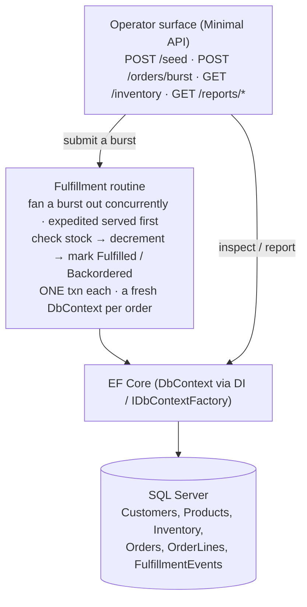

# Project — Order Fulfillment Service (Solo, Weeks 4–5) — **Minimal-API edition**

## Objective

Build **one coherent, production-shaped backend service**: an **Order Fulfillment Service** — a **Minimal-API**
app that takes a burst of incoming orders and fulfills them **concurrently** against a **shared, limited
inventory** stored in a real SQL database through **EF Core**. It is a single service you would be comfortable
demoing to a stakeholder as *"the service that fulfills our orders."*

The headline engineering problem is **correctness under concurrency**: many orders draw down the same stock at
once, and the service must **never oversell** (never fulfill an order that takes inventory below zero) while
still going **measurably faster** than one-at-a-time.

You build this **solo**, across **Weeks 4–5**, and **present it live on Friday of Week 5 (Jul 10)**.

Everything you need is taught by **end of Week 4**: C# + OOP (Wk1–2), collections/generics/exceptions/patterns/
Serilog (Wk2), SQL — schema, joins, transactions, ACID, isolation, indexes (Wk3), and **EF Core, LINQ, data
structures, and multithreading served from a Minimal API (Wk4)**. The API is **Minimal API** — controllers

---

## Logistics

| | |
|---|---|
| **Handed out** | Mon Jun 29 (after the EF-in-Minimal-API intro) |
| **Presented** | **Fri Jul 10** — live demo to the room/stakeholders |
| **Mode** | **Solo** — one learner, one repo, one domain |
| **Stack** | .NET **Minimal API** · EF Core (code-first) · SQL Server in Docker · Serilog |
| **Submission** | Your `FirstName-LastName` repo: runnable app + migrations + seed + README writeup |
| **Scaffold** | **None.** No starter, no solution key. Designing the schema, the endpoints, and the concurrency strategy **is** the project. |

---

## The stakeholder blurb (your acceptance spec)

> *A backend application that processes large batches of customer orders against live inventory in real time.
> Multiple orders are filled at the same time — rush orders ahead of standard ones — while stock counts stay
> accurate to the unit, so the system never promises items it doesn't have. Operators run it from a simple
> menu: load the catalog, submit a wave of orders, watch them get fulfilled live, and pull reports on top
> products, top customers, and fulfillment rates. Built to handle high volume quickly and shut down cleanly
> without ever losing or mishandling an order.*

Everything below is this blurb made concrete. The **"simple menu"** is your **Minimal-API surface** (the
operator drives it from Swagger / curl / Postman); "watch them fulfilled live" is the inspect endpoint + the
Serilog stream.

---

## What You're Building

A **Minimal-API service** with a small set of operator endpoints sitting on top of a **concurrent fulfillment
routine** that does the real work against EF Core + SQL Server.

`POST /orders/burst` returns immediately (the burst runs on a background `Task`) so the operator surface stays
responsive while the fulfillment routine drains the wave.

---

## Your Domain (pick your own — not Library)

The trainer demos use **Library** (copies of a title as the scarce stock). You build the **same ideas in a
domain of your own**. Any *"catalog of items with limited stock, and a stream of orders competing for it"* works.

| Domain | "Product" | "Order" | The scarce thing |
|--------|-----------|---------|------------------|
| E-commerce | SKU / product | Customer order | Units on hand |
| Event ticketing | Show / section | Ticket purchase | Seats remaining |
| Restaurant kitchen | Menu item | Table ticket | Prepped portions |
| Warehouse picking | Bin item | Pick list | Bin quantity |
| Ride / appointment dispatch | Slot / vehicle | Booking | Available slots |

Pick one and commit. The rest of this spec is domain-neutral — translate Product / Order / inventory into yours.

---

## What the App Must Do (User Stories)

Each story is a behavior an operator (or a stakeholder watching) can **see** at the API. Acceptance criteria
are what you point at on Friday.

### Catalog & inventory

- **Seed and inspect.** *As an operator, I can seed a catalog of products with starting stock and list current
  on-hand quantities at any time.*
  - Accept: `POST /seed` then `GET /inventory` shows each product + starting quantity; re-listing after a burst
    reflects the drawn-down numbers.

### Concurrent fulfillment (the core)

- **Fulfill a burst concurrently.** *As an operator, I can submit a burst of N orders and the service fulfills
  them concurrently while the API stays responsive.*
  - Accept: `POST /orders/burst` returns immediately; order statuses move from Pending to a terminal state over
    time, processed by **multiple concurrent workers** (visible in the Serilog stream).
- **Never oversell.** *As a stakeholder, I am guaranteed the service never fulfills an order that would take
  stock below zero, even when many orders hit the same product at once.*
  - Accept: after a burst whose demand **exceeds** stock, **on-hand never goes negative** and **units fulfilled
    == units depleted** for every product. Unmet orders are cleanly **Backordered**, never partially oversold.
    An order is **all-or-nothing in one transaction**. (Single-line orders are a fine MVP simplification — say
    which you chose.)
- **Expedited first.** *As an operator, I can mark orders expedited, and expedited orders are served ahead of
  normal ones.*
  - Accept: when expedited and normal orders are queued together, the expedited reach a terminal state first
    (visible by completion order / timestamps).

### Resilience & observability

- **Graceful shutdown.** *As an operator, I can stop the service and it finishes or safely abandons in-flight
  work and flushes its logs — no lost or half-applied order.*
  - Accept: on shutdown, no order is left partial (inventory decremented but order not marked, or vice versa);
    the log file is complete.
- **A trail of what happened.** *As an operator, I can read a structured log tagged by severity.*
  - Accept: a session shows info / warning / error lines tied to real fulfillment events, with structured fields
    (order id, product, quantity) — never string concatenation.

### Reporting & analysis

- **Reports.** *As a stakeholder, I can see top products and top customers by volume, and the overall
  fulfillment-vs-backorder rate.*
  - Accept: `GET /reports/top-products`, `/reports/top-customers`, `/reports/fulfillment-rate` return different
    results for different runs; a ranked report is sorted, and I can look up one product's rank quickly.
- **Sequential vs parallel benchmark.** *As an engineer, I can run the same burst once sequentially and once
  concurrently and see the time/throughput difference.*
  - Accept: `POST /benchmark` prints both timings + a speedup factor; the parallel run is faster on a multi-core
    machine (or you explain why not). **Reset stock to the same start between runs** or the comparison is junk.

---

## Engineering Definition of Done (how you build it)

### Web surface (Minimal API)

- A **Minimal-API host** (`dotnet new web`) exposing the operator endpoints above with `MapGet`/`MapPost`,
  route + query + body **model binding**, and correct **status codes** (200 / 201 / 202 / 400 / 404 / 409).
- The `DbContext` is **registered in DI** (`AddDbContext` / `AddDbContextFactory`) and resolved per request —
  **not** `new`-ed in `Main`. (This is EF in its real home; the same wiring carries straight into Project 2's
  controllers.)

### Data layer (EF Core, code-first, SQL Server)

- A **code-first** EF Core model — normalized to **3NF**, FKs + referential integrity:
  - `Customer` (id, name, unique email)
  - `Product` (id, **unique indexed SKU**, name, `decimal(10,2)` price)
  - `InventoryItem` (id, 1:1 to Product, `QuantityOnHand`, **`byte[] RowVersion` concurrency token**)
  - `Order` (id, FK Customer, `Priority` enum, `Status` enum, created/completed timestamps)
  - `OrderLine` (id, FK Order, FK Product, quantity)
  - `FulfillmentEvent` (id, FK Order, type, message, timestamp) — audit trail
- **Migrations** create the schema; a **seed** populates a catalog **and customers**. Use **Data Annotations**
  for simple constraints, **Fluent API** in `OnModelCreating` for what annotations cannot express (concurrency
  token, 1:1, indexes). At least one **non-key index** (SKU, `Order.Status`) — and you can say why.
- Persistence goes through a **repository behind an interface**; callers depend on the interface, not EF types.

### Concurrency (the headline)

- Fulfill a burst with the **simplest correct** approach: a set of `Task`s (`Task.WhenAll` / `Parallel.ForEach`)
  over the burst, **each task its own `DbContext`** (from the factory — `DbContext` is **not thread-safe**; one
  per order fulfilled, disposed when done — **not** one per worker).
- **No overselling.** Each fulfillment decrements stock inside **one transaction** (atomicity) and the inventory
  row is protected by **EF optimistic concurrency** (the `RowVersion` token): if two tasks race the same
  product, the loser catches **`DbUpdateConcurrencyException`**, reloads, re-checks, and **retries** (bounded).
  In your writeup, contrast this with the **in-memory `lock`/`Interlocked`** alternative (the `Bank` demo from
  the threading day) and say when each fits.
- **Expedited-first** via a **`PriorityQueue<T>`** (or a clearly-justified two-lane equivalent).
- Use a **`CancellationToken`** to stop gracefully; handle task exceptions so one bad order does not kill the run
  silently.

### Data structures & the benchmark (DSA)

- A report is **sorted** and you can **binary search** the sorted result (find a product's rank).
- Inventory/customer lookups go through a **hash-based** structure (`Dictionary` / `ConcurrentDictionary`), not
  a linear scan.
- Your README states the **Big-O** of your priority queue, your lookups, and your report sort, and **why** each
  fits.

### Cross-cutting

- **Serilog** configured **once** at startup and flushed on exit, **structured-template** form
  (`Log.Information("Fulfilled {OrderId} x{Qty} of {Sku}", ...)`), never string concatenation.
- A **Factory** builds orders/order-lines (rejecting an unknown kind in its `default` arm); the **repository**
  centralizes persistence.
- Bad input fails loudly through a **custom exception that carries data** (e.g. the missing SKU), caught
  **specific-before-base**.

---

## Techniques You Must Demonstrate (coverage contract)

**EF Core** — code-first model (≥1 Data Annotation + ≥1 Fluent API mapping) · `DbContext` registered in DI ·
`DbSet<T>` + change tracking + `SaveChanges` · migrations + seed · a `RowVersion` concurrency token.
**Minimal API** — `MapGet`/`MapPost` endpoints · model binding (route/query/body) · effective status codes.
**SQL (through EF)** — 3NF + FKs + ≥1 non-key index · one fulfillment = one **transaction** + **ACID/isolation**
reasoning written down.
**Multithreading** — concurrent burst (`Task.WhenAll` / `Parallel.ForEach`) · **per-order `DbContext`** · the
**oversell race solved** (EF optimistic concurrency + retry; `lock`/`Interlocked` alternative discussed) · a
**`ConcurrentDictionary`** used correctly · **`CancellationToken`** shutdown + exception handling · a
**sequential-vs-parallel benchmark** + a one-line note on parallelism-vs-concurrency.
**DSA** — a **priority queue** for expedited-first · a **sorted report + binary search** · hash-based lookups ·
Big-O stated.
**Patterns & cross-cutting (Wk2)** — **repository behind an interface** + a **Factory** · **Serilog** structured
logging · a **custom exception** that carries data, handled specific-before-base.

---

## Scope tiers (solo, Wk4–5 — ship the Floor, aim for Target)

**No-overselling is the one hard problem and stays central at every tier.** Everything around it is allowed to
be simple at the Floor.

### Floor — MVP (must ship; the graded core)

- EF Core model + **migrations + seed** (catalog **and customers**) against SQL Server in Docker, `DbContext` in
  DI.
- Minimal-API endpoints: `POST /seed`, `POST /orders/burst`, `GET /inventory`, **one** report.
- **No overselling** with the **simplest correct** approach: `Task.WhenAll` over the burst, **each task its own
  `DbContext`**, **one transaction per order**, guarded by the **`RowVersion` retry**. Prove it: on-hand
  **never negative**, units-fulfilled **==** units-depleted.
- The burst runs on a **background `Task`** so the API stays responsive./
- **Serilog** structured logging; README writeup mapping each technique to the type that proves it.

### Target — the intended build (aim here)

- **Expedited priority** via a **`PriorityQueue<T>`** (expedited drained first).
- **Benchmark done right:** reset inventory between runs, print both timings + a speedup factor.
- **`CancellationToken` graceful stop** + per-task exception handling — no half-applied order, `CloseAndFlush`.
- **`ConcurrentDictionary`** lookups; a **sorted** report + a **binary search**; **Big-O** stated.
- **Repository behind an interface** + a **Factory**; a **custom exception** that carries data.

### Stretch / honors — only after Target is green

- **The original console worker-pool engine**: swap `Task.WhenAll` for a bounded **`BlockingCollection<T>`
  producer-consumer worker pool** with N persistent workers (see the kept `order-fulfillment-engine-README.md`
  - `order-fulfillment-engine-minimal-path.md` for that ladder).
- **Optimistic-vs-lock A/B**; a true two-lane expedited queue; a SQL **view/proc** via EF `FromSql`; a second
  Serilog sink; an **isolation-level experiment** (raise it, watch throughput fall).

> **Stuck at the Floor?** Concurrency is the only genuinely hard rung. If you can fulfill **one** order correctly
> in a transaction with the `RowVersion` retry (the trainer demo's Step you mirrored), you can fulfill a burst —
> wrap that exact method in `Task.WhenAll`, each task its **own** context. Get a passing Floor first.

---

## Submission & Friday (Wk5) Presentation

**In the repo:** the application in its final state + migrations + seed + the README writeup.

**Live demo (Fri Jul 10):**

1. `POST /seed`; `GET /inventory`.
2. `POST /orders/burst` with demand **exceeding** stock; let it process.
3. **Prove no overselling** — on-hand never negative; units-fulfilled == units-depleted.
4. `POST /benchmark` (reset stock between runs) and read off the speedup.
5. Walk the architecture in ~2 minutes: the endpoints, the per-order context, the transaction, the concurrency
   token.

Pitch it as a product: *"this is the service that fulfills our orders, and here is why it is correct and fast."*

> **Looking ahead — Project 2 (Wk6–7):** you rewrite this Minimal-API service as a **controller-based API**
> (controllers, DTOs, a service layer, AutoMapper, middleware) and put a **React front end** on it. The DI/EF
> wiring you built here carries straight over — the rewrite is structural, not a restart.
