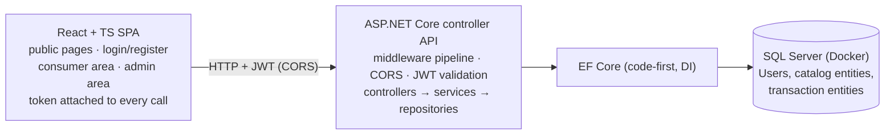

# Project 2 — Full-Stack Web Application (Teams of 3, Weeks 6–7)

## Objective

Build **one complete, production-shaped web application** as a team: a **React front end** talking to an
**ASP.NET Core controller Web API**, with **JWT authentication and role-based authorization**,
an **EF Core code-first data layer**, and **SQL Server** underneath. Two kinds of people use it: a
**consumer** who signs up, signs in, browses a catalog, and creates transactions of their own — and an
**admin** who manages that catalog and reads business reports. Each role sees exactly what it should,
in the UI and at the API.

The headline engineering problem is **the seam**: a browser app and an API are two separate programs that
must agree on a contract — routes, DTOs, status codes, tokens, and CORS. Getting one program right is
Week-4 news; getting **two programs to work as one product** is Project 2.

You build this in a **team of 3**, across **Weeks 6–7**, and **present it live on Friday of Week 7
(Jul 24, 14:00–17:00)** as a demo to stakeholders.

This is a **single final spec — there are no staged deliverables**. Here is the spec; build to it in a
two-week sprint. The MVP / Target / Stretch tiers below describe **how much of it you shipped**, not
phases you hand in separately.

---

## Logistics

| | |
|---|---|
| **Handed out** | Mon Jul 13 |
| **Presented** | **Fri Jul 24, 14:00–17:00** — live demo to the room/stakeholders; ~25 minutes per team; **every member presents** |
| **Mode** | **Team of 3** — one shared repo, one domain, one product (teams announced at handout) |
| **Stack** | ASP.NET Core **controller** Web API · **JWT + roles** (your own Users table, hashed passwords — **not** ASP.NET Identity) · EF Core (code-first) · SQL Server in Docker · **React + TypeScript** SPA |
| **Submission** | The team repo: runnable API + runnable SPA + migrations + seed + README writeup |
| **Scaffold** | **No code scaffold.** No starter, no solution key. You scaffold both ends yourself with the CLI workflows demoed in class (`dotnet new webapi --use-controllers`; the React toolchain demoed Week 7). Designing the schema, the API contract, and the pages **is** the project. |

**Where the time comes from:** every PM block in Weeks 6–7 is project time. All of the **server side is
already taught** (controllers, DTOs, service layer, AutoMapper, validation, middleware, JWT, caching,
CORS — Weeks 4–5); the Week-6 AM demos give you HTML/CSS/JS/TS and the Week-7 AM demos give you React.
A natural rhythm — not a graded checkpoint, just physics: **Week 6 = data model + API + auth working
end-to-end in Swagger/Postman; Week 7 = the React front end over it.** Teams that leave the API for
Week 7 are building both programs at once during React week.

---

## The stakeholder blurb (your acceptance spec)

> *A web application where customers create an account, sign in, browse and search a live catalog, and
> place their own orders or bookings — while staff sign in to a separate view to manage that catalog and
> watch reports on what is moving. Every screen and every piece of data sits behind proper login, each
> role sees only what it is entitled to, and the whole thing runs as a modern single-page app backed by
> a real database.*

Everything below is this blurb made concrete.

---

## What You're Building

Two programs, one product:

The SPA is served by its own dev server; the API runs on its own port. They are **different origins** —
CORS is not optional homework here, it is the door your app walks through.

**Vocabulary used below (translate into your domain):** a **catalog item** is the thing consumers browse
(product, show, court, class, dish...); a **transaction** is the thing a consumer creates against it
(order, booking, reservation, enrollment, appointment...). Your entity names are **yours**.

---

## Your Domain (team's choice)

Pick any domain where *consumers browse a catalog and create transactions against it, and staff curate
that catalog*. You may **carry a member's Project-1 domain or theming forward if you wish — this is
allowed, not required.** Project 2 does **not** have to build on Project 1's code or model.

| Domain | Catalog item | Transaction | Consumer / Admin |
|--------|-------------|-------------|------------------|
| Storefront | Product | Order | Shopper / Merchandiser |
| Event ticketing | Show + section | Ticket purchase | Fan / Box office |
| Court or gym booking | Court, class slot | Booking | Member / Front desk |
| Clinic | Appointment slot | Appointment | Patient / Scheduler |
| Restaurant | Dish | Pickup order | Diner / Kitchen manager |
| Learning platform | Course | Enrollment | Student / Instructor |

Pick one and commit as a team. The rest of this spec is domain-neutral.

---

## Required Skeleton (user stories every team ships)

Each story is a behavior a stakeholder can **see** — in the browser, and provably at the API. Acceptance
criteria are what you point at on Friday.

### Accounts & access

- **Register.** *As a visitor, I can create an account from the SPA.*
  - Accept: a registration form creates a user; the password is **stored hashed (with salt) — never
    plaintext, never reversible encoding**; registering an email/username that already exists is handled
    cleanly (no crash, no duplicate row, a sane message). **Registration creates consumer-role accounts
    only; admin accounts come from the seed** — a public "register as admin" option defeats the role
    story and fails it.
- **Log in / log out.** *As a registered user, I can sign in and the app remembers who I am until I sign
  out.*
  - Accept: good credentials return a **JWT** the SPA stores and attaches to subsequent API calls; bad
    credentials produce **401** and a readable message in the UI; logout drops the token and returns me
    to the public view.
- **Two roles, really enforced.** *As a stakeholder, I know consumers cannot touch admin capability —
  even if they craft the HTTP request by hand.*
  - Accept — **both layers, demonstrated live**:
    - **API:** anonymous request to a protected endpoint → **401**; authenticated *consumer* request to
      an *admin* endpoint → **403** (shown via Swagger/Postman/curl, not just the UI).
    - **UI:** admin routes/controls are not rendered (or redirect) for consumers; consumer-only views
      are behind login.

### Consumer area

- **Browse & search the catalog.** *As a consumer, I can list the catalog and narrow it (search or
  filter).*
  - Accept: a catalog page renders from a `GET` endpoint; a search/filter input changes the result set
    via query parameters (server-side filtering — not filtering a fully-downloaded list in the browser).
- **Create a transaction.** *As a consumer, I can create a transaction against a catalog item.*
  - Accept: a form submits, the API validates (bad input → **400** with the reason surfaced in the UI;
    unknown item → **404**), success returns **201**, and the new transaction is visible immediately.
- **See my own — and only my own.** *As a consumer, I can view my transaction history, and I can never
  see anyone else's.*
  - Accept: the list endpoint scopes to the **authenticated user from the token claims** — not from a
    user id passed in the query string (that is the classic vulnerability; we will ask).

### Admin area

- **Curate the catalog.** *As an admin, I can add, edit, and remove catalog items.*
  - Accept: full CRUD from admin pages, correct verbs and status codes (`201` created, `204` deleted,
    `400` invalid, `404` missing); changes visible to consumers on next load.
- **Read a report.** *As an admin, I can see at least one business report.*
  - Accept: a report endpoint aggregates real transaction data (top items, volume per day, busiest
    whatever) and an admin page renders it; sorted output where ranking is claimed.

### Team-defined features

- **At least 2 feature stories of your own** — wishlist, reviews, cancellation flow, capacity limits,
  schedules, notifications panel... Anything full-stack (touches API **and** UI).
  - Accept: each written **as a user story with acceptance criteria** on the board and in the README
    before it is built. Writing them is **MVP**; implementing and demoing them Friday is **Target**
    (see the tiers).

---

## Engineering Definition of Done (how you build it)

### API (ASP.NET Core, controllers)

- **Controllers + action methods** (`[ApiController]`, attribute routing, verb annotations) — REST URL
  conventions, and **status codes that match outcomes** (200 / 201 / 204 / 400 / 401 / 403 / 404).
- **DTOs on the wire, entities never** — request and response shapes are records/classes designed for
  the contract, mapped with **AutoMapper**.
- **Service layer behind interfaces**, registered in DI, injected into controllers; persistence behind a
  **repository interface**. Controllers stay thin: bind, delegate, translate to HTTP.
- **Model binding + validation annotations** — `[FromRoute]`/`[FromQuery]`/`[FromBody]` used
  deliberately; `[Required]`/ranges/lengths on incoming DTOs; `[ApiController]` turns `ModelState`
  failures into 400s (surface those messages in the SPA, don't swallow them).
- **Middleware pipeline you can explain:** global **exception-handling middleware** (no raw 500 stack
  traces to the browser), `UseAuthentication`/`UseAuthorization` **in the correct order**, CORS
  configured for the SPA origin. Know what order your pipeline runs in and why — the HTTP-pipeline
  question is a QC-4 Must.

### AuthN / AuthZ (hand-rolled, the `07` shape)

- A **Users table of your own design** (id, unique username/email, password hash + salt, role).
  **No ASP.NET Identity** — it is untaught and does the thinking this project wants you to do.
  Use a real hashing approach (e.g. `PasswordHasher<T>` from Microsoft.Extensions.Identity.Core used
  standalone, or a well-known hashing package like BCrypt); **plaintext or Base64 passwords fail this
  section outright.**
- **Token issuance in an injected service** (`ITokenService` → `TokenService`) with endpoints on an
  **`AuthController`** (`register`, `login`) — the shape demoed in `07-cross-cutting`. Signing key from
  **configuration**, not a string literal in code.
- The JWT carries the user's **role as a claim**; protected endpoints use **`[Authorize]`** and admin
  endpoints **`[Authorize(Roles = ...)]`**.

### Data layer (EF Core, code-first, SQL Server)

- Code-first model, **3NF**, FKs + referential integrity; **migrations** create the schema; a **seed**
  provides a demo-able catalog, an admin account, and a consumer account (so Friday starts from
  `docker start` + `dotnet run`, not from hand-typing data).
- At least **one non-key index** you can justify (the searched column, a FK you join on...).
- Connection string from **configuration**, not hardcoded.

### Front end (React + TypeScript)

- Scaffolded with the toolchain demoed in Week 7; **TypeScript** throughout (typed props, typed API
  response models — mirror your DTOs as TS interfaces/types).
- **Components with props/state/hooks**; lists rendered with keys; conditional rendering for the
  role-dependent UI.
- **Routing** with public / login / consumer / admin areas; **role-gated routes** (unauthenticated →
  login; wrong role → redirected or not rendered).
- **API calls through a single client layer** (Axios instance or a fetch wrapper) that attaches the JWT
  once (interceptor or equivalent) — not copy-pasted headers in every component. Auth state lives
  somewhere sane (Context is the taught tool).
- **Controlled-component forms** for register/login/create/edit, with **loading and error states** — a
  failed API call shows the user something better than a blank screen or a console error.
- Honest CSS: layout via flexbox/grid, responsive enough to survive a projector. This is not a design
  course — it is a "does not look broken" bar.

### Team workflow (light Agile — this is graded evidence, not ceremony)

- **One shared repo** (one member hosts, all three collaborate). **Nobody pushes to `main` directly** —
  every change lands by **feature-branch PR reviewed by a teammate** before merge.
- A **visible board** (GitHub Projects or equivalent): the skeleton stories + your team stories as
  cards, moving across columns all sprint — not backfilled the night before.
- **Team-run standups** — a short daily sync (live or async thread): what moved, what's next, what's
  blocked. No trainer attendance required; the habit is the point.
- **Per-member accountability is commit and PR authorship.** Divide work in vertical slices (a story
  end-to-end) rather than "one person does all the CSS." We will look at the history.

---

## Techniques You Must Demonstrate (coverage contract)

**How this grades against the tiers:** an MVP-only submission demonstrates every line marked (MVP); the
full contract is satisfied at Target. The README maps **each line to the code that proves it** (type,
endpoint, component, or file).

**API (QC-4 spine)** — controllers + action methods (MVP) · HTTP method annotations + REST conventions
(MVP) · DTOs, entities never on the wire (MVP) · service behind an interface in DI (MVP) · AutoMapper
(MVP) · model binding route/query/body (MVP) · validation annotations → automatic 400 (MVP) · effective
status codes incl. 401/403 (MVP) · the middleware pipeline described + a custom global
exception-handling middleware (MVP) · `UseAuthentication`/`UseAuthorization` ordered correctly (MVP) ·
CORS for the SPA origin (MVP) · response/server-side **caching** on a hot read (Target) · a **custom
action filter** or second custom middleware (Target) · typed `HttpClient` consuming a 3rd-party API
(Stretch).
**Auth** — hashed+salted passwords (MVP) · `ITokenService`/`AuthController` issuance, key from config
(MVP) · role claim + `[Authorize]`/`[Authorize(Roles=...)]` (MVP) · 401-vs-403 explained and demoed
(MVP) · refresh/expiry UX (Stretch).
**Data** — code-first + migrations + seed (MVP) · 3NF + FKs (MVP) · ≥1 justified non-key index (MVP) ·
config-first connection string (MVP).
**Front end (Wk6–7 spine)** — TypeScript types/interfaces mirroring DTOs (MVP) · components +
props/state/hooks (MVP) · routing + role-gated routes (MVP) · Axios/fetch client layer with token
attach (MVP) · controlled forms (MVP) · lists + keys, conditional rendering (MVP) · loading/error
states (Target) · Context for auth state (Target) · flexbox/grid responsive layout (Target).
**Workflow** — feature-branch PRs w/ teammate review, no direct `main` pushes (MVP) · live board (MVP) ·
standup evidence (Target).

Minimal API endpoints are **not part of this build** — you did that in Project 1; this API is
controllers end to end.

---

## Scope tiers (one spec — these measure how far you got, they are not phases)

### MVP (must ship; the graded core)

- All **skeleton stories** green: register, login/logout, role enforcement at **both** layers
  (401/403 at the API + gated routes in the UI), consumer browse/search + create + own-history,
  admin CRUD + one report.
- **Full auth in the MVP** — two roles, JWT with role claim, hashed passwords, token from an injected
  service. Auth is not a stretch goal in this project; it is the project.
- React + TS SPA over the whole surface; EF migrations + seed; DTO/service-layer/AutoMapper/validation/
  exception-middleware/CORS per the DoD.
- Your **2+ team stories written** (board + README) — implementation may still be in flight.
- Workflow evidence: PR history with reviews, a board that moved.

### Target (the intended build — aim here)

- The **2+ team-defined stories implemented and demoed**.
- **Caching on a hot read** (`[ResponseCache]` and/or `IMemoryCache` — and you can say which layer did
  what); a **custom action filter** or second middleware doing something real.
- Report done right: sorted, meaningfully aggregated, paged if long.
- UX states everywhere (loading, empty, error); Context-managed auth state; responsive layout.
- Validation depth: server annotations + client-side form feedback that agree with each other.

### Stretch (only after Target is green)

- **Consume a third-party API** through a typed `HttpClient` service (the `07` beat) and surface it in
  the product.
- Token **expiry/refresh UX** (expired token → clean re-login, not a broken page); a third role.
- Early **xUnit tests** on the service layer (Week 8 does this properly — a head start is Stretch, not
  expected).
- Anything your team stories grow into.

> **Stuck?** The riskiest integration is the seam, not the pieces. Get **one** protected round trip
> working end-to-end early: login form → token stored → one authenticated `GET` → data on a page.
> Once that path is green, every remaining story is a variation of it.

---

## Submission & Friday (Jul 24) Presentation

**In the repo:** both apps runnable + migrations + seed + the README writeup.

**The README writeup — one checklist:**

- [ ] Your **domain** and the entity map (what "catalog item" and "transaction" are for you).
- [ ] **How to run it**: DB up (Docker), API up, SPA up — commands, ports, seeded logins (admin +
      consumer demo accounts).
- [ ] The **technique → code map**: every coverage-contract line pointed at the type / endpoint /
      component that proves it.
- [ ] The **auth flow, written down**: register → hash → login → token (what claims) → SPA storage →
      attached header → validation → role gate. One paragraph or a small diagram.
- [ ] **401 vs 403** in your own words, with the two endpoints that prove each.
- [ ] Why your **non-key index** exists; your report's query in one sentence.
- [ ] **Status codes** your surface produces and why.
- [ ] **Who built what** — per-member summary consistent with the PR/commit history.
- [ ] Your **team stories** with their acceptance criteria.

**Live demo (~25 min, every member speaks):**

1. **Pitch the product** (2 min) — the blurb, your domain, your team stories.
2. **Consumer flow:** register (or log in) → browse/search → create a transaction → see it in "my
   history."
3. **Admin flow:** log in as admin → CRUD a catalog item → show the consumer view reflecting it → the
   report.
4. **Prove the gates:** anonymous API call → **401**; consumer token on an admin endpoint → **403**
   (Swagger/Postman/curl, live); the admin UI absent for the consumer.
5. **Architecture walk** (~5 min): the two programs and the seam (CORS + JWT), the pipeline order, a
   controller → service → repository trace, the EF model, and **one problem that fought back** and how
   you beat it.

Pitch it as a product, not homework: *"this is our app, here is who uses it, and here is why the right
people can do the right things and nobody else can."*

> **Looking ahead — Project 3 (Wk8–9):** you build **xUnit, Cypress, and Selenium test suites against
> this application**. Keep it runnable, keep it seeded, keep the repo — your future self is the next
> stakeholder. (QC-4 — administered in the combined QC-3+QC-4 sitting, Friday Jul 17 AM — examines the
> API-side techniques in this spec — building the MVP **is** the study guide.)
