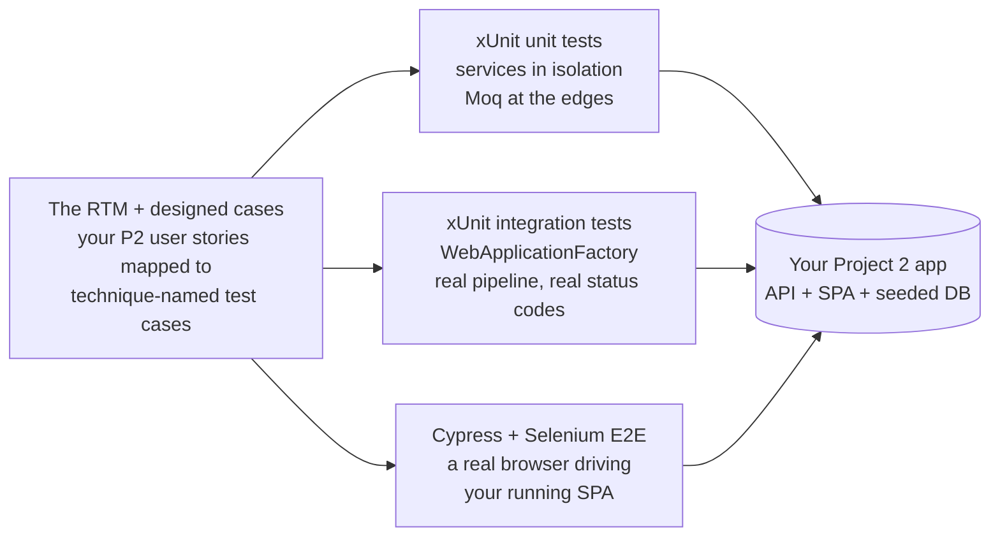

# Project 3 — Test Suites for Your Project-2 Application (Teams of 3–4, Weeks 8–9)

## Objective

Build **one three-layer automated test suite** as a team, against **the application your team built in
Project 2**: **xUnit unit tests** proving your service logic in isolation (Moq where a dependency
warrants it), **xUnit integration tests** driving your real API through `WebApplicationFactory`, and
**end-to-end tests in a real browser** — Cypress against your React SPA, with Selenium proving the
same ground from a second toolchain. Underneath all three layers sits the artifact this project is
really about: a **designed case set** — every case traced to a requirement, every technique named,
every piece of test data chosen on purpose.

The headline engineering problem is **not writing tests — it is defending a case set**. Anyone can
write two hundred tests; Project 3 is being able to answer *"is this release safe?"* with evidence:
a matrix showing every requirement traced to the cases that prove it, cases that say why they exist
and where their data came from, and a record of the hunting you did for the defects no requirement
ever mentioned. Getting a test to pass is Week-8-Monday news; **proving what your suite covers — and
knowing what it doesn't — is Project 3.**

You build this in the **same team as Project 2**, in the **same repository as your Project 2 app**
(the suites live inside the application they test), across **Weeks 8–9**, and present at the
**combined Project 2 + Project 3 sitting** — one presentation covering the product *and* its proof.

This is a **single final spec — there are no staged deliverables, and this spec is final at handout:
the scope does not change.** Here is the spec; build to it. **There is one scope set — everything
in this spec is required.** The only optional line is the CI pointer at the end of the coverage
contract (Week 10's material).

---

## Logistics

| | |
|---|---|
| **Handed out** | At the Project 3 handout session (early in the sprint window; date recorded at handout) |
| **Presented** | The **combined Project 2 + Project 3 sitting** — Week 10 at the earliest; exact date announced at a later planning session. ~25 minutes per team; **every member presents**. You demo your product **and** walk its test suite. |
| **Mode** | **Same Project 2 teams (3–4 members), same repository** — the suites are added to the app they test: xUnit projects under a `tests/` folder beside your API solution, Cypress as your SPA's own dev dependency, Selenium as a C# project beside it (the placement demoed in the Week 8 sessions — the xUnit, Cypress, and Selenium-intro walkthroughs) |
| **System under test** | **Your own Project 2 application** — API + SPA + seeded database, kept runnable. The P2 spec told you to keep it seeded and runnable; this is why. |
| **Stack** | xUnit + FluentAssertions + Moq · `WebApplicationFactory` (Microsoft.AspNetCore.Mvc.Testing) · Cypress · Selenium WebDriver (C#) |
| **Submission** | The team repo: all suites runnable + the design artifacts (RTM, documented test cases, error-guess log, exploratory session notes) + the README writeup |
| **Scaffold** | **No code scaffold.** No starter, no solution key. The class demos show every tool's shape against the trainer's app; designing and building the case set **for your app, against your requirements**, is the project. |

**This spec is final at handout.** Nothing gets added to it during the sprint. If a topic the spec
names slips out of the taught schedule, the adjustment happens on the grading side and is announced —
the spec itself does not change, and nothing new appears in it.

**Where the time comes from:** PM blocks in Weeks 8–9 are project time by default — when a taught
session runs long it takes precedence, and the Week 10 runway absorbs it. The QC-5 sitting
(Thursday of Week 8) and the QC-6 sitting (Friday of Week 9, AM) sit inside the window — the scope
is sized with that in mind. A natural rhythm — not a graded checkpoint, just physics: **Week 8 =
design artifacts (RTM + documented cases) plus the xUnit unit and integration suites; late Week 8
into Week 9 = Cypress; Selenium work starts once its Week 9 sessions have taught it** — its deadline
is the same final submission as everything else. Teams that automate before designing are building a
suite that cannot say what it covers.

---

## The stakeholder blurb (your acceptance spec)

> *The team that built the product must now prove it works — and keeps working. We want a test suite
> that answers "is this release safe?" with evidence: every requirement traced to the tests that
> prove it, every test able to say why it exists and where its data came from, coverage from
> millisecond unit checks up to a real browser driving the real app — and a written record of the
> hunting done for the defects no requirement ever mentioned.*

Everything below is this blurb made concrete.

---

## What You're Building

One case set, three layers of proof, all against your running Project 2 app:

The pyramid is not decoration: each requirement gets proven at the **lowest layer that can prove
it**, and the expensive browser layers hold the flows that only a browser can prove.

**Vocabulary used below (translate into your app):** your Project 2 app has **a consumer flow**
(register or log in → browse → create a transaction), **an admin-gated capability** (the thing a
consumer must never reach), **validation rules** (the inputs your API rejects with 400),
**an ownership rule** ("I see my own and only my own"), and **a report read**. Whatever your domain
called these things, those capabilities are what your suite proves. This spec names capabilities
only — your entity names are yours.

---

## Your System Under Test

Your Project 2 repository **is** the deliverable's home. The suites land in it through the same
pull-request workflow you used to build it. Two rules govern touching the app itself:

- **Finding a defect in your own app is a finding, not an embarrassment.** That is the suite doing
  its job. File it (an issue, a board card — somewhere visible), fix it through a PR, and have the
  fixing PR cite the test case that caught it. Defects you find and fix are presentation material —
  the best five minutes of your demo is a bug your suite caught.
- **Every change to app code traces to a finding.** This project does not freeze your app, but it is
  not Project 2.5 either — new features are out of scope. App commits during this sprint are fixes,
  each one pointing at the case that motivated it. (Completing work the Project 2 spec already
  required is Project 2 work, not a new feature — the combined sitting still grades it; "out of
  scope" means capabilities neither spec asked for.)

---

## Required Skeleton (deliverables every team ships)

Each deliverable is something a stakeholder can **read or run**. Acceptance criteria are what you
point at during the presentation.

### The requirements traceability matrix

- **An RTM mapping your requirements to your test cases.** *As a stakeholder, I can see which
  requirements are proven, by which tests, and which are not.*
  - Accept: the requirements axis is **your Project 2 user stories** — the required skeleton stories
    plus your team-defined stories. You already wrote these with acceptance criteria in Project 2;
    reuse them. The case axis is your designed test cases, and it **grows as the suite grows —
    maintained through the sprint, not backfilled the night before** (the git history of the RTM
    file is evidence).
  - Accept: the matrix reads **in both directions** — an empty requirement row is a declared
    coverage gap, an empty case column is a case you either trace or delete. Requirements you
    deliberately did not cover appear as **declared residual risk** in the README, not as silence.
  - Accept: coverage is ordered — **every requirement covered once before any requirement is covered
    twice.** Format is your choice (a markdown table in the repo is fine); the discipline comes from
    the test-case-design note, which is your reference for all of this.

### Designed cases, before automation

- **Test cases documented before they are automated.** *As a reviewer, I can read what a test will
  prove — and how — before the code that automates it exists.*
  - Accept: each case carries the taught minimum shape — identifier, requirement trace,
    preconditions, steps, expected result — with the **expected result written before execution**.
  - Accept: each case **names the technique that produced it**, chosen from the shape of the
    requirement (the technique-selection table in the test-case-design note is the lookup).
  - Accept: **equivalence partitioning and boundary-value analysis are each demonstrably applied
    somewhere in the suite** — real partitions of a real input, real boundaries of a real limit,
    named as such in the case docs, visible in the automated tests they produced.
  - Accept: the case documentation lands in the repo **before or with** the PR that automates it —
    the PR history is the evidence that design preceded automation.
  - Accept: every automated test **carries its trace** — the case identifier in the test name, a
    comment, or an attribute — so a red test resolves to a case, and the case to a requirement.

### A deliberate test-data strategy

- **Test data chosen by objective, stored by object.** *As a maintainer, I know where every test's
  data lives and why it lives there.*
  - Accept: for each kind of test object (a service under unit test, the API under integration test,
    the running app under E2E), the README states **which data home you chose** — inline values,
    data files/fixtures, a seeded store, created-by-the-case, or mocks/stubs — and what that choice
    trades (determinism versus proof, per the test-case-design note).
  - Accept: **deterministic by construction** — no wall-clock time, no unseeded randomness, no
    "whatever is in the database today."
  - Accept: cleanup runs **even when the test fails** — teardown lives in the framework's
    guaranteed hooks, not after the last assertion.

### The three suite layers

- **An xUnit unit suite.** *As a developer, I get millisecond-fast proof of the service rules on
  every commit.*
  - Accept: your service-layer rules under test in isolation; **Moq used where a dependency warrants
    isolation** (repositories, external calls) — and only there; validation rules and the ownership
    rule proven at this layer where they live in service code.
- **An xUnit integration suite.** *As a stakeholder, I get proof the real HTTP surface honors its
  contract.*
  - Accept: `WebApplicationFactory` drives your actual API through its real pipeline; the **auth
    matrix is proven** — anonymous request to a protected endpoint → 401, authenticated consumer on
    an admin endpoint → 403; **validation returns 400** with your rules enforced; a happy path per
    core capability returns its documented success code.
- **A Cypress E2E suite.** *As a stakeholder, I can watch the product prove itself in a browser.*
  - Accept: at minimum, **one consumer flow end-to-end** (sign in → browse → create a transaction →
    see it appear) and **the admin flow with the gate proven from the UI side** — the admin
    capability works for an admin, and the UI a consumer sees does not offer it.

### Selenium coverage

- **A Selenium suite proving a flow the browser already proved with Cypress.** *As a stakeholder, I
  know the team can drive a browser from more than one toolchain — and I get a second, independent
  proof of the product's most important path.*
  - Accept: a C# Selenium WebDriver project in the repo; **at least one consumer flow automated
    end-to-end, mirroring a flow your Cypress suite covers** (the parity beat — same capability, two
    toolchains); element location through **stable, resilient locators**; synchronization through
    **explicit waits — no blind sleeps**; the suite organized so page structure lives in one place
    (**page objects**), not copy-pasted selectors.
  - The Week 9 Selenium sessions teach everything this deliverable needs; its natural build window
    is after them, and its deadline is the same final submission as every other deliverable.

### The hunting record

- **A sourced error-guess log.** *As a stakeholder, I know the team hunted for the defects the
  requirements never mentioned.*
  - Accept: **at least 3 documented error guesses**, each one sourced (past defects, known-fragile
    input classes, domain knowledge, recent churn — not free-floating intuition) and recorded in the
    taught one-line format: hypothesis, source, the case that tested it, the result. Confirmed
    guesses become permanent, traced regression cases.
- **Two exploratory testing sessions** (the second under a different charter, informed by what the
  first found). *As a stakeholder, I know someone probed whether the requirements themselves were
  right.* For each session:
  - Accept: a **charter** written before the session — grounded in a source you can name (an
    insight from your error-guess log, a defect cluster, a risky area) — a **timebox** (60–120
    minutes), and **session notes** recording what was covered, what was found, and how the time
    split.
  - Accept: findings **mapped back into the RTM** — each one resolved as a defect against a
    requirement (file it, add a regression case), a gap in the requirements (write the question
    down), or surprising-but-correct behavior (note it).

---

## Engineering Definition of Done (how you build it)

### Test design discipline

- One behavior per case — a red result names one thing.
- Design before automation, provable from PR history; every automated test carries its case trace.
- Technique named per case; the technique fits the requirement's shape and you can say why.

### xUnit suites

- Arrange–act–assert structure; a naming convention that carries the trace.
- **FluentAssertions** for readable failure output.
- `[Theory]` with inline data where a case set came from equivalence classes or boundary values —
  **and the case docs say the rows came from those techniques**, so the data rows are visibly a
  design product, not arbitrary examples.
- **Moq only where a dependency warrants isolation** — mock the edges you are not testing;
  mock-everything is a smell you should be able to defend against.
- Shared context through the framework's fixture mechanisms where setup repeats.
- **Code coverage measured** with the tooling demoed in class, the report read, and **at least one
  case added because the report showed an unexecuted branch** — that case is named as white-box
  driven in its documentation.

### Integration suite

- `WebApplicationFactory` hosting your real app through its real middleware pipeline.
- A **stated test-database strategy** — what the integration tests run against and how it resets to
  a known state (the integration-testing and EF-testing-strategies notes lay out the options; pick
  one and defend it in the README).
- Assertions on **status codes and response contracts** — the same contract your P2 README
  documented.

### Cypress

- The structure demoed in class: describe/context blocks, hooks for setup, one behavior per spec.
- **Resilient selectors** — dedicated test attributes or equally stable hooks, not brittle
  text-and-position selectors.
- Fixtures and network intercepts used **where your data strategy calls for them** — and the
  strategy says which E2E specs run against real seed data versus intercepted responses, and why.
- The suite runs headless (`npx cypress run`, or your repo's `npm run cy:run` script) green from a
  clean checkout.

### Selenium

- A C# WebDriver project, runnable with `dotnet test` alongside your xUnit suites.
- **Explicit waits for synchronization — no `Thread.Sleep` scattered through specs.**
- **Page objects**: page structure encapsulated once, specs read as intent.
- Stable locator strategy consistent with what your Cypress suite established.

### Test data and determinism

- The per-object data-home table in the README (see the skeleton deliverable).
- Deterministic everywhere: fixed or injected time, seeded randomness, pinned rows.
- Cleanup in guaranteed-teardown hooks; a failed run does not poison the next run.

### Team workflow

- **Same repo, same rules as Project 2:** nobody pushes to `main` directly — every change lands by
  **feature-branch PR reviewed by a teammate**.
- The **board** stays visible and moving: design tasks, automation tasks, findings.
- **Team-run standups** — short, regular, yours; the habit is the point.
- **Per-member accountability is commit and PR authorship.** Divide by vertical slices — a
  requirement designed, automated, and green across its layers — not "one person writes all the
  Cypress." We will look at the history.
- App fixes ride the same workflow, each PR citing the finding that motivated it.

---

## Techniques You Must Demonstrate (coverage contract)

**How this grades:** every line below is required — **one set, no tiers**. The README maps **each
line to the artifact or code that proves it** (the RTM file, a case doc, a test class, a spec
file).

**Design (QC-6 spine)** — RTM with both-direction reads and declared residual risk · case
anatomy: id / trace / preconditions / steps / expected-before-execution · technique named per
case, selected from the requirement's shape · equivalence partitioning applied and named
· boundary-value analysis applied and named · coverage ordered — every requirement once before
any requirement twice · at least one white-box, coverage-driven case, named as such · a
decision table or state-transition case set where a requirement's shape calls for one — combining
conditions or a lifecycle; if you claim no requirement has that shape, the README says so and defends
it · pyramid placement: each case at the lowest layer that proves it, justified.
**xUnit unit** — AAA + trace-carrying names · FluentAssertions · `[Theory]` rows sourced
from EP/BVA · Moq where dependencies warrant, and only there · shared-context fixtures
where setup repeats · coverage measured, report read, one branch-driven case added.
**Integration** — `WebApplicationFactory` suite green · 401/403 auth matrix ·
400 validation proof · stated test-DB strategy · happy path per core capability with
documented status codes.
**Cypress** — one consumer flow end-to-end · admin flow + UI-side gate proof · resilient
selectors · fixtures/intercepts consistent with the stated data strategy · headless run
green · custom commands extracting your repeated steps.
**Selenium** — one Cypress-parity consumer flow · explicit waits, no sleeps · page
objects · stable locators · breadth beyond the parity flow · a written
Cypress-versus-Selenium comparison from your own two suites.
**Data** — per-object data home stated with its trade · determinism by construction ·
failure-safe cleanup.
**Hunting** — 3+ sourced, documented error guesses · confirmed guesses graduated to traced
regression cases · two charter/timebox/notes exploratory sessions (the second under a different
charter) · findings mapped back into the RTM ·
a test-data staleness / case-efficacy review with recommendations · a stakeholder-facing
risk-and-coverage summary.
**Workflow** — feature-branch PRs with teammate review · live board · standup evidence
· finding-traced app-fix PRs where fixes happened.

The **one optional line**: continuous-integration runs of the suite. CI/CD is Week 10's
material; a team that gets there early may wire it, but nothing in this spec requires it.

---

## What you ship (one spec, one set — everything below is the graded core)

This project runs **no scope tiers**. The whole intended build is required: **the case-design
discipline is not a stretch goal here, it is the project** — an undesigned suite that happens to
pass misses the point the way an unauthenticated Project 2 would have.

- The **RTM** over all your Project 2 skeleton stories + your team stories, maintained through the
  sprint, both-direction reads clean (no untraced cases), residual risk declared.
- **Every requirement has at least one designed case**; every case names its technique; EP and BVA
  each applied and named; at least one white-box, coverage-driven case; a decision-table or
  state-transition set where shape calls for it.
- **Unit suite green**: services isolated, Moq at the edges, Theory rows from EP/BVA, coverage
  measured and read.
- **Integration suite green**: real pipeline, 401/403/400 matrix, happy paths with documented codes.
- **Cypress green**: the consumer flow and the admin flow with its UI-side gate, resilient
  selectors, headless run, **custom commands** extracting your repeated steps.
- **Selenium green**: the parity flow **and breadth beyond it** — explicit waits, page objects,
  stable locators — plus your own written **Cypress-versus-Selenium comparison** from the two
  suites you built.
- **The data strategy** stated per object, deterministic, failure-safe — and a **test-data
  staleness and case-efficacy review** near the end of the sprint: which cases have never failed
  and what that means, which data has drifted, what you would change — written down.
- **The hunting record**: 3+ sourced error guesses logged; confirmed guesses **graduated into
  permanent regression cases** with requirement traces; **two** charted, timeboxed, documented
  exploratory sessions (the second under a different charter); findings mapped back into the RTM.
- A **stakeholder-facing risk summary**: coverage, residual risk, and what you would test next with
  another week.
- **Workflow evidence**: PR history with reviews, a board that moved, standups that happened.

The one line that is **not** required: **CI** — the suite running on push. Week 10 teaches it
properly; wiring it early is welcome, not expected, and nothing above depends on it.

> **Stuck?** The riskiest artifact is the one none of you has built before — the RTM — and the
> cheapest insurance is to take **one requirement end-to-end early**: one RTM row → one documented
> case → green at unit, integration, and E2E. Once one requirement is traced and proven at every
> layer, every remaining requirement is a variation of it. **Start with the companion walkthrough
> handed out with this spec** (`p3-design-artifacts-walkthrough.md`) — it takes your team from zero
> to exactly that first traced requirement, step by step.

---

## Submission & Presentation (the combined P2+P3 sitting)

One sitting, one presentation per team, covering **both projects**: the product you built and the
suite that proves it. The date is Week 10 at the earliest and will be announced at a later planning
session — the deliverables above are due at that sitting.

**In the repo:** the P2 app still runnable + all suites runnable + the design artifacts + the README
writeup.

**The README writeup — one checklist:**

- [ ] Where the **RTM** lives and how to read it (both directions, in your own words).
- [ ] **How to run each suite**: unit, integration, Cypress (interactive + headless), Selenium —
      commands, prerequisites, expected green counts.
- [ ] The **technique → artifact map**: every coverage-contract line pointed at the file, class, or
      case doc that proves it.
- [ ] The **data-strategy table**: per test object, the home you chose and the trade you accepted.
- [ ] Your **coverage summary and declared residual risk**: what is proven, at which layer, and what
      you knowingly did not cover, with the reason.
- [ ] The **error-guess log** and **exploratory session notes**, with their RTM map-backs.
- [ ] **Defects found and fixed**, each linking the case that caught it to the PR that fixed it.
- [ ] **Who built what** — per-member summary consistent with the PR/commit history.

**Live demo (~25 min, every member speaks):**

1. **The product** (~10 min) — your Project 2 demo, per the P2 spec's presentation section: pitch,
   consumer flow, admin flow, the 401/403 gates proven live. This sitting is also Project 2's
   presentation record — treat it as such.
2. **The RTM walk** — pick one requirement and trace it live: the row, its designed cases, the
   techniques that produced them, and the green runs proving it at each layer.
3. **Run the suites** — `dotnet test` (unit + integration + Selenium) and a Cypress run (headless
   tail or one interactive spec), live.
4. **One defect story** — the case, guess, or exploratory finding that caught something real; the
   fix PR; the regression case that guards it now.
5. **The design defense** (~5 min) — why these techniques for these requirements, the data trade you
   chose, what you deliberately did not cover and why, and **one thing your suite still cannot
   tell you**.

Pitch it as evidence, not homework: *"here is our product, here is the proof it works, and here is
exactly where that proof ends."*

> **Looking ahead:** the **QC-6 exam (Friday of Week 9, AM)** examines exactly this material — test
> design, RTMs, techniques, test data, xUnit, Cypress, Selenium. **Building these artifacts is the
> study guide.** Weeks 10–11 move to cloud and DevOps, where the optional CI line becomes the taught
> path — a suite that already runs green from the command line is one YAML file away from running
> on every push.
